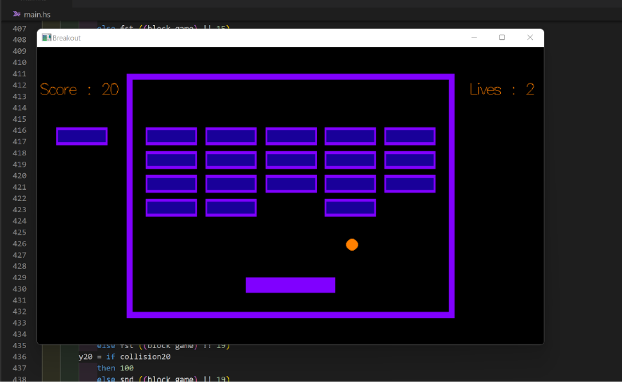

# Breakout Game

This is a classic Breakout game implemented in Haskell, where the player controls a paddle to bounce the ball and hit the blocks. The objective is to break all the blocks on the screen by hitting them with the ball. The player starts with three lives, and each time the ball hits the bottom wall, the player loses a life. If the player loses all three lives, the game is over. The player can earn points by hitting the blocks, and if the score reaches 200, the player wins the game.




## Installation

To run the game, you need to have Haskell and the Gloss library installed on your system.

1. Install Haskell: You can download and install Haskell from the official Haskell website: [https://www.haskell.org/downloads/](https://www.haskell.org/downloads/)

2. Install Gloss: Open a terminal and run the following command to install the Gloss library:

   ````
   cabal update
   cabal install gloss
   ```

## Usage

1. Clone this repository or download the source code files.

2. Open a terminal and navigate to the project directory.

3. Run the following command to start the game:

   ````bash
   ghc -o breakout breakout_game.hs
   ./breakout
   ```

4. The game window will open, and you will see the paddle, ball, and blocks on the screen.

5. Use the left and right arrow keys to move the paddle horizontally and bounce the ball. The ball will start moving automatically.

6. Try to hit the blocks with the ball by bouncing it off the paddle. Each time the ball hits a block, your score will increment.

7. Be careful not to let the ball hit the bottom wall. If the ball hits the bottom wall, you will lose a life. If you lose all three lives, the game is over.

8. Keep playing and breaking the blocks to earn points. If your score reaches 200, you win the game!

9. To quit the game at any time, simply close the game window.

## Customization

You can customize the game to modify its behavior or add new features. Here are some possible customizations:

- **Graphics and Design:** If you want to change the appearance of the game, such as the colors, images, or fonts used, you can modify the code in `breakout_game.hs` and update the relevant functions responsible for rendering the graphics.

- **Game Difficulty:** You can adjust the game difficulty by changing parameters such as the speed of the ball, the number of blocks, or the size of the paddle. These variables can be found in `breakout_game.hs`, and you can modify them according to your preferences.

- **Power-ups and Special Effects:** If you want to add power-ups, special effects, or new game mechanics, you can explore the code in `breakout_game.hs` and add new functions or modify existing ones to incorporate these features.

- **Scoring System:** If you wish to modify the scoring system or change the conditions for winning or losing the game, you can edit the code in `breakout_game.hs` and update the score calculation, win/lose conditions, or any other related logic.

## Contributing

If you encounter any issues, have suggestions for improvement, or would like to contribute to this project, please feel free to open an issue or submit a pull request on the GitHub repository.

## License

This project is licensed under the [MIT License](LICENSE). You are free to use, modify, and distribute the code as per the terms of the license.
